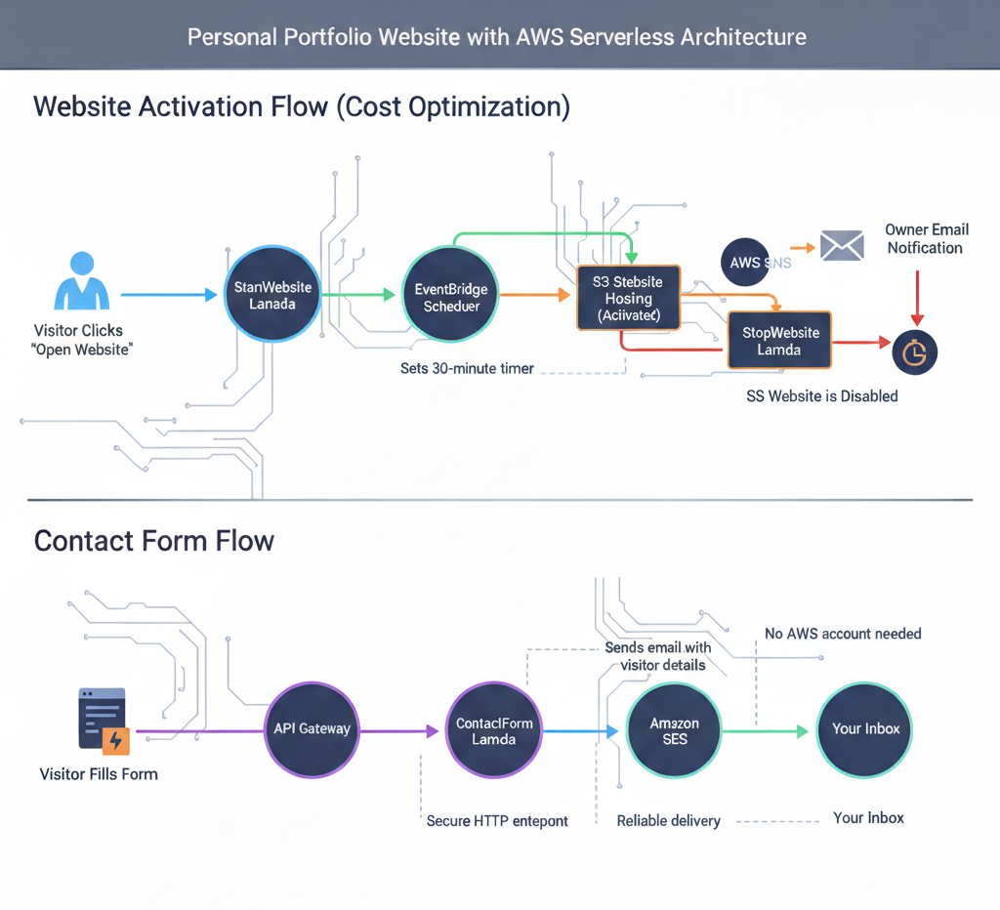

# On-Demand Portfolio

[](https://on-demand-portfolio-five.vercel.app)
[](https://2dubub6pbj.execute-api.us-east-1.amazonaws.com/start/)
[](#tech-stack)

My personal portfolio website — but with a twist.

On the surface, it's a clean, responsive single-page site that shows off my skills, projects, experience, and certifications. Under the hood, the whole thing is wired up as an event-driven serverless application on AWS with automated lifecycle management.

No frameworks. No build tools. Just one HTML file and a handful of Lambda functions.

**Author:** Sameer Sayyad
— [LinkedIn](https://www.linkedin.com/in/sameer-sayyad-673820291/) · [GitHub](https://github.com/Sayyaddsameer) · [sayyadsameerm3@gmail.com](mailto:sayyadsameerm3@gmail.com)

---

## Two Ways to Access the Portfolio

### 1. Vercel — Always On

**→ [on-demand-portfolio-five.vercel.app](https://on-demand-portfolio-five.vercel.app)**

This is the straightforward path. The portfolio is deployed on Vercel and is always accessible. No Lambda, no waiting — just open the link and you're in.

### 2. AWS API Gateway — On-Demand (30-Minute Window)

**→ [Start API](https://2dubub6pbj.execute-api.us-east-1.amazonaws.com/start/)**

This is the interesting one. Clicking this link triggers an AWS Lambda function (`StartWebsite`) that:

1. Makes the S3-hosted copy of the portfolio **public** by applying a bucket policy
2. Sends me an **SNS email notification** (so I know someone visited)
3. Schedules an **EventBridge one-shot timer** for 30 minutes from now
4. **Redirects** you (302) to the actual S3 website URL

After 30 minutes, the `StopWebsite` Lambda fires automatically and removes the bucket policy — making the site private again.

If another visitor hits the Start API while the site is already up, the timer gets pushed out another 30 minutes. It's an upsert pattern — create-or-update the same EventBridge schedule. So the window stays open as long as people keep coming.

### How to Verify the 30-Minute Window

1. Open the [Start API URL](https://2dubub6pbj.execute-api.us-east-1.amazonaws.com/start/) in your browser. You'll get redirected to the portfolio.
2. Wait 30 minutes (or check EventBridge Scheduler in the AWS Console — look for a schedule named `stop-portfolio-website`).
3. After 30 minutes, `StopWebsite` Lambda removes the S3 public access policy.
4. Try accessing the S3 website endpoint directly — you should get a **403 Forbidden**.
5. Click the Start API link again — the site comes back up for another 30 minutes.

You can also check **CloudWatch Logs** for the Start and Stop Lambda functions to see the exact invocation timestamps.

---

## Architecture

### Website Activation Flow

```
Visitor clicks Start API
    → StartWebsite Lambda
        → Applies S3 bucket policy (site goes public)
        → Schedules EventBridge timer (30 min)
        → Sends SNS notification
        → 302 redirect to S3 website
    → [30 minutes later]
        → StopWebsite Lambda fires
        → Removes S3 bucket policy (site goes private)
```

### Contact Form Flow

```
Visitor fills out form
    → API Gateway endpoint
        → Lambda function
            → Amazon SES
                → My inbox
```

No AWS account needed on the visitor's side. Lambda handles everything with a verified SES sender identity.



---

## Tech Stack

### Frontend

- **HTML5, CSS3, Vanilla JavaScript** — all in a single file (`portfolio.html`)
- **Google Fonts** (Inter)
- **Font Awesome 6.5** icons
- CSS custom properties for light/dark theming
- `IntersectionObserver` for scroll-triggered animations
- Parallax scrolling effects

### Backend (AWS Serverless)

- **AWS Lambda** — Start/Stop website lifecycle + SES contact form handler
- **Amazon API Gateway** — HTTP endpoints for the start API and contact form
- **Amazon EventBridge Scheduler** — 30-minute auto-stop timer
- **Amazon SES** — Contact form email delivery
- **Amazon SNS** — Visit notification alerts
- **Amazon S3** — Static hosting for the on-demand path
- **AWS IAM** — Least-privilege roles for all inter-service communication
- **Amazon CloudWatch** — Logging and monitoring

### Deployment

- **Vercel** — Primary, always-on deployment
- **AWS S3 + API Gateway** — On-demand path with lifecycle automation

---

## Features

- Fully responsive design (mobile, tablet, desktop)
- Dark / Light theme toggle with `localStorage` persistence
- Typewriter animation for professional roles
- Parallax scrolling effects
- Multiple scroll animations (fade-in, slide-in, scale-up) via `IntersectionObserver`
- Scroll progress indicator
- Cover-flow project showcase with snap scrolling
- Interactive card hover effects with mouse-follow glow
- Serverless contact form (API Gateway → Lambda → SES)
- Honeypot spam protection on the contact form
- Accessibility: `prefers-reduced-motion` support, semantic HTML, ARIA labels

### Sections

Hero · About · Skills · Experience · Education · Projects (6 featured) · Coding Portfolio · Certifications · Resume · Contact

---

## Running Locally

It's a single HTML file — there's no build step.

```bash
# Clone the repo
git clone https://github.com/Sayyaddsameer/OnDemand-Portfolio.git
cd OnDemand-Portfolio

# Option 1: Just open the file
# Double-click portfolio.html or drag it into your browser

# Option 2: Local server (recommended)
python -m http.server 8000
# Then open http://localhost:8000/portfolio.html

# Option 3: VS Code Live Server
# Right-click portfolio.html → "Open with Live Server"
```

> **Note:** The contact form talks to the AWS backend (API Gateway → Lambda → SES), so it won't actually send emails when running locally. Everything else works fine offline.

---

## AWS Services Used

| Service | Purpose |
|---|---|
| Amazon S3 | Static hosting for the on-demand portfolio path |
| AWS Lambda | Website lifecycle automation + contact form handler |
| EventBridge Scheduler | Auto-stop trigger after 30 minutes |
| API Gateway | HTTP endpoints for start and contact APIs |
| Amazon SES | Sends contact form emails |
| Amazon SNS | Visit notification alerts |
| AWS IAM | Least-privilege access control |
| CloudWatch | Logging and monitoring |

---

## Project Structure

```
OnDemand-Portfolio/
├── portfolio.html              # The entire frontend — single file
├── sameer.png                  # Profile photo
├── sameer_resume.pdf           # Resume PDF
├── vercel.json                 # Vercel deployment config
├── robots.txt                  # Search engine directives
├── architecture/
│   ├── architecture_diagram.png
│   ├── website_workflow.png
│   └── contact_form_workflow.png
├── Lambda_Functions/
│   ├── Start_website_lambda.py
│   ├── Stop_website_lambda.py
│   └── send_messages_SES_lambda.py
├── backend/                    # Documentation & annotated Lambda code
│   ├── README.md
│   ├── Start_website_lambda.py
│   ├── Stop_website_lambda.py
│   ├── send_messages_SES_lambda.py
│   └── OnDemandPortfolio_Documentation.pdf
└── img/                        # Project screenshots & assets
```

---

## Why Build It This Way?

Honestly, S3 static hosting is already dirt cheap — so the on-demand pattern isn't really about saving money here. The point was to demonstrate **event-driven lifecycle automation** using real AWS services. In production scenarios with EC2 instances, ECS tasks, or other compute-heavy workloads, this same start/stop pattern can save serious money by eliminating idle resource charges.

This project applies that architectural thinking in a simplified context. It's a portfolio, but it's also a working demo of serverless orchestration, automated scheduling, and infrastructure state management.

---

Built by [Sameer Sayyad](https://github.com/Sayyaddsameer) · Feel free to reach out at [sayyadsameerm3@gmail.com](mailto:sayyadsameerm3@gmail.com)
